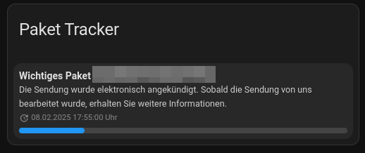

# Parcel Tracker Add‑On

Mit dem **Parcel Tracker Add‑On** kannst du deine DHL-Pakete ganz einfach im Blick behalten. Das Add‑On ermöglicht es dir, DHL-Trackingnummern zu verwalten – du kannst sie hinzufügen, den aktuellen Status abrufen und auch wieder entfernen. Gleichzeitig stellt das Add‑On eine REST-API bereit, die alle aktiven Sendungen als JSON-Liste liefert. Diese Daten kannst du entweder über einen REST-Sensor in Home Assistant nutzen oder über eine benutzerdefinierte Lovelace-Karte direkt im Dashboard anzeigen lassen.

[](https://www.buymeacoffee.com/nils.kt) [](https://my.home-assistant.io/redirect/supervisor_addon/?addon=7b702346_parcel_tracker)


---

## Screenshots
| Screenshot | Beschreibung |
|------------|---------------|
|  | Übersicht der Web-Oberfläche mit allen aktiven Sendungen. |
|  | Custom Lovelace-Karte zur Anzeige der Sendungsdaten im Home Assistant Dashboard. |

## Funktionen

- **DHL-Paketverfolgung:**  
  Das Add‑On ruft regelmäßig den aktuellen Status deiner DHL-Sendungen ab und zeigt das Datum der letzten Aktualisierung an.

- **Web‑Oberfläche:**  
  Eine moderne, mit Tailwind CSS gestaltete Oberfläche (erreichbar auf Port **58784**) ermöglicht es dir, Trackingnummern einzutragen und deine aktiven Sendungen in einer übersichtlichen Tabelle zu verwalten.

- **REST-API:**  
  Über den Endpunkt `/trackings` werden alle aktiven Sendungen als JSON bereitgestellt.  
  *Beispiel:* `http://<HA-IP>:58784/trackings`

- **Custom Lovelace-Karte:**  
  Nutze eine eigens entwickelte Lovelace-Karte, die direkt die API-Daten abruft und im Dashboard anzeigt. Die JavaScript-Datei der Karte ist abrufbar unter:  
  `http://<HA-IP>:58784/static/card.js`

- **Automatische Aktualisierung:**  
  Ein Hintergrundprozess aktualisiert in festgelegten Intervallen (über `update_interval` konfigurierbar) den Sendungsstatus.

- **Benachrichtigungen:**  
  Bei aktivierter Option `notify_on_change` wird Home Assistant automatisch per persistent_notification informiert, wenn sich der Status einer Sendung ändert.

---

## Installation und Einrichtung

### Repository hinzufügen

Gehe in Home Assistant zu **Einstellungen → Add-ons → Add-on Store** und klicke auf **„Repositories“**.  
Gib die URL des Repositories ein: `https://github.com/nils-kt/nils-kt-addons`

### Add‑On installieren

1. Nach dem Hinzufügen des Repositories erscheint das Add‑On **Parcel Tracker** im Add‑On Store.
2. Wähle **Parcel Tracker** aus und klicke auf **Installieren**.
3. Öffne anschließend die Add‑On-Konfiguration und passe folgende Parameter an:
   - **update_interval:**  
     (Intervall in Minuten für die Aktualisierung der Sendungsdaten, Standard: 10)
   - **notify_on_change:**  
     (Boolean – bei Statusänderung soll eine Benachrichtigung erfolgen, Standard: false)
   - **host_ip:**  
     (IP-Adresse deines Home Assistant-Systems, Standard: 127.0.0.1)
4. Speichere die Einstellungen und starte das Add‑On neu.

---

## Nutzung der Web‑Oberfläche

Nach dem Start läuft der Webserver des Add‑Ons auf Port **58784**.

- **Aufruf:**  
  Öffne in deinem Browser `http://<HA-IP>:58784/` (ersetze `<HA-IP>` durch die IP deines Home Assistant).

- **Funktionen:**  
  - **Trackingnummern hinzufügen:**  
    Nutze das Formular, um eine neue DHL-Trackingnummer zur Überwachung hinzuzufügen.
  - **Sendungen verwalten:**  
    In der Tabelle siehst du alle aktiven Sendungen mit Informationen zu Status und letztem Update. Mit einem Klick auf den Lösch-Button entfernst du eine Sendung.
  - **Footer:**  
    Ein Link zum GitHub-Repository ist im Footer eingebunden.

---

## REST-API

Der Endpunkt liefert alle aktiven Sendungen als JSON:

- **URL:**  
  `http://<HA-IP>:58784/trackings`

---

## Custom Lovelace-Karte

Für eine ansprechende Darstellung im Dashboard kannst du die benutzerdefinierte Lovelace-Karte verwenden:

1. **Ressource einbinden:**  
   Die Karte wird durch die JavaScript-Datei bereitgestellt, die unter  
   `http://<HA-IP>:58784/scripts/card.js`  
   abrufbar ist. Füge diese Ressource in dein Lovelace-Dashboard ein:
   - **URL:** `http://<HA-IP>:58784/scripts/card.js`  
   - **Typ:** `JavaScript-Modul`

2. **Karte hinzufügen:**  
   Erstelle eine neue Karte in deinem Dashboard mit folgendem YAML:

   ```yaml
   type: custom:parcel-tracker-card
   api_url: "http://<HA-IP>:58784/trackings"
   ```

   Ersetze `<HA-IP>` durch die IP-Adresse deines Home Assistant.

---

## Benachrichtigungen

Wenn **notify_on_change** aktiviert ist, vergleicht das System bei jeder Aktualisierung den aktuellen Status mit dem vorherigen. Bei Änderungen wird automatisch eine persistent_notification an Home Assistant gesendet.  
*Hinweis:* Für die Benachrichtigungen müssen die Umgebungsvariablen `HASS_URL` (z. B. `http://<HA-IP>:8123`) und `HASSIO_TOKEN` korrekt gesetzt sein.

---

## Support & Weiteres

- **GitHub-Repository:**  
  Weitere Informationen, Updates und den Quellcode findest du unter:  
  [https://github.com/nils-kt/nils-kt-addons](https://github.com/nils-kt/nils-kt-addons)

- **Fehler melden & Feedback:**  
  Bei Fragen oder Problemen wende dich bitte über die Issues im GitHub-Repository an den Entwickler.

---

## Lizenz

Dieses Add‑On ist unter der [MIT-Lizenz](LICENSE) veröffentlicht.